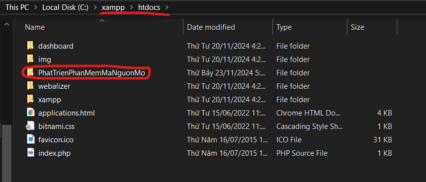
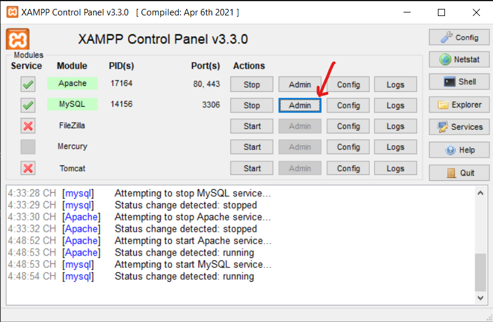
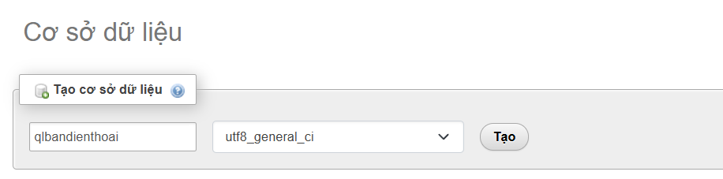
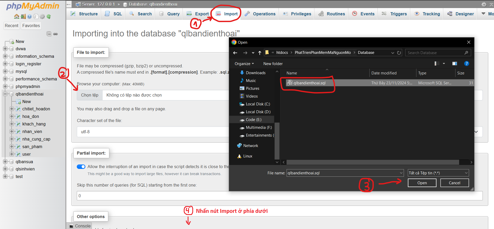
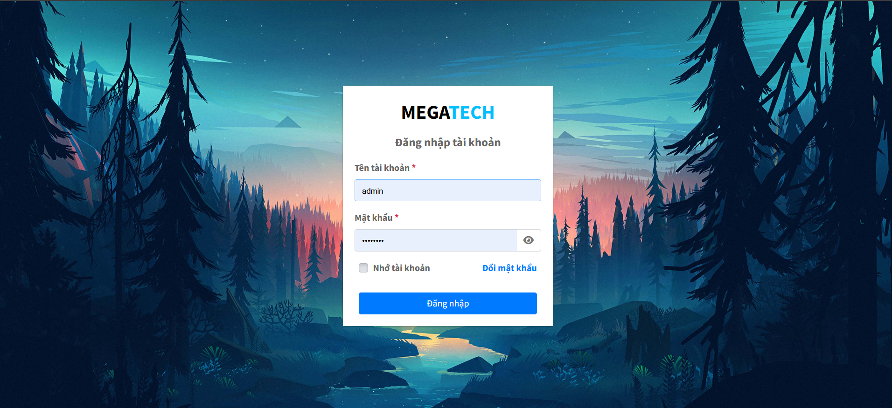
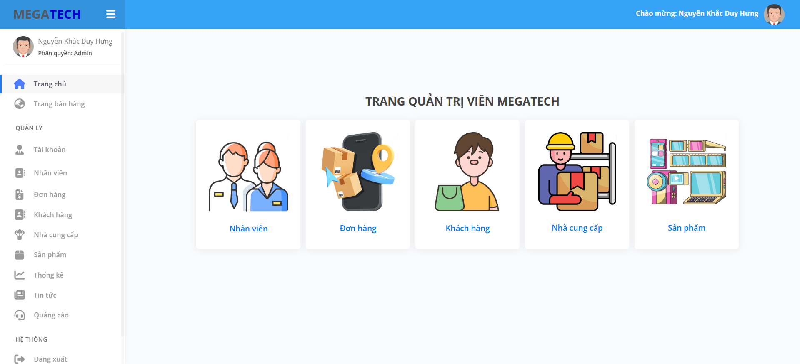
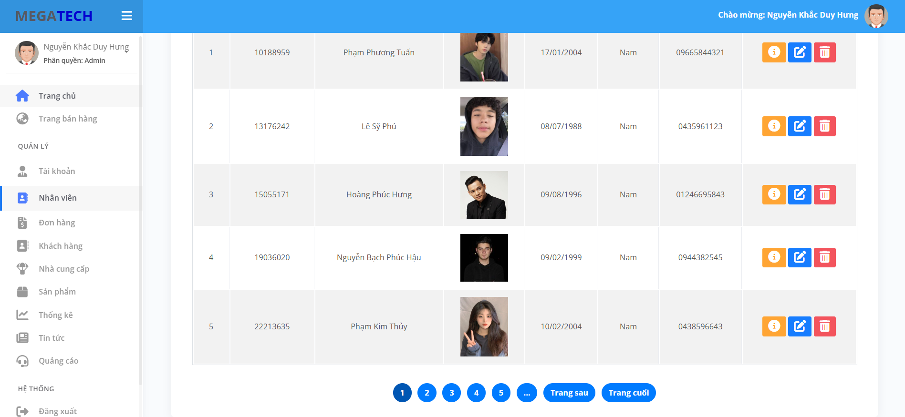
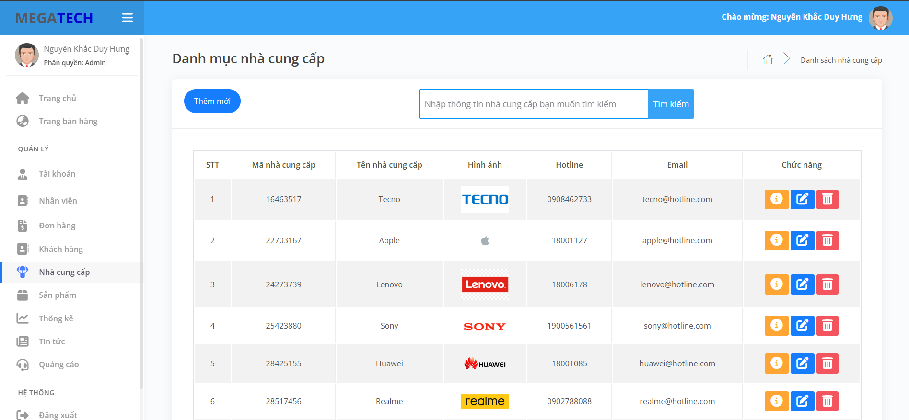
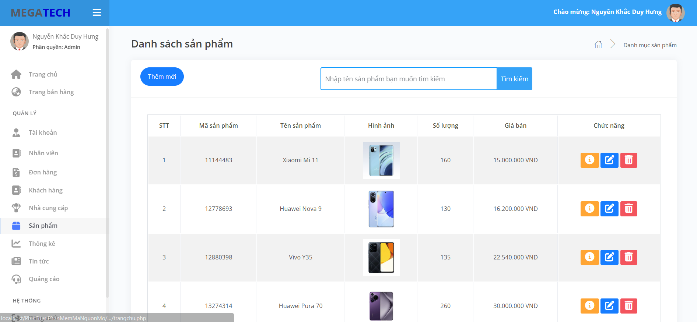
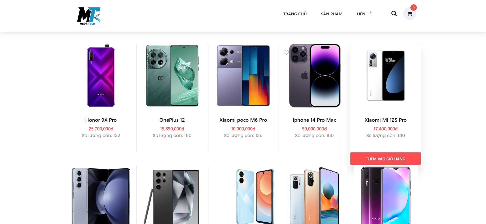

# HỌC PHẦN PHÁT TRIỂN PHẦN MỀM MÃ NGUỒN MỞ

Bài tập lớn của học phần Phát triển phần mềm mã nguồn mở 2024

**Đề tài**: Xây dựng Website quản lý bán điện thoại MEGATECH

## HƯỚNG DẪN CÀI ĐẶT

1. Tải source code chương trình về máy:
   
   ```bash
   git clone https://github.com/hungnguyen2912003/PhatTrienPhanMemMaNguonMo.git
   ```
- Đưa source code vào mục htdocs của XAMPP (Nếu thay đổi thư mục gốc (Web Root) thì hãy đến đường dẫn đã thay đổi đó)

<div align="center">  </div>

2. Khởi động XAMPP và truy cập vào trang http://localhost/phpmyadmin/ hoặc nhấn vào nút Admin bên cạnh nút Start của MySQL.

<div align="center">  </div>

- Tạo mới một Database có tên là qlbandienthoai, mã đối chiếu là utf8_general_ci.

<div align="center">  </div>

- Import cơ sở dữ liệu trong folder Database của source code (file qlbandienthoai.sql).
  
<div align="center">  </div>

3. Trên trình duyệt, truy cập vào link để truy cập Website

   ```bash
   http://localhost/PhatTrienPhanMemMaNguonMo/QLBanDienThoai_Nhom5_PTPMMNM_63CNTT2/admin/trangchu.php
   ```

4. Tài khoản Admin để đăng nhập
   
- Username: admin
- Password: 123456

5. Sử dụng các Phần mềm IDE để viết code (Visual Studio Code, Sublime Text, Notepad++, PHPStorm, ...)

## MỘT SỐ GIAO DIỆN CỦA WEBSITE

<div align="center">  </div>

<div align="center">  </div>

<div align="center">  </div>

<div align="center">  </div>

<div align="center">  </div>

<div align="center">  </div>

<div align="center">  </div>
